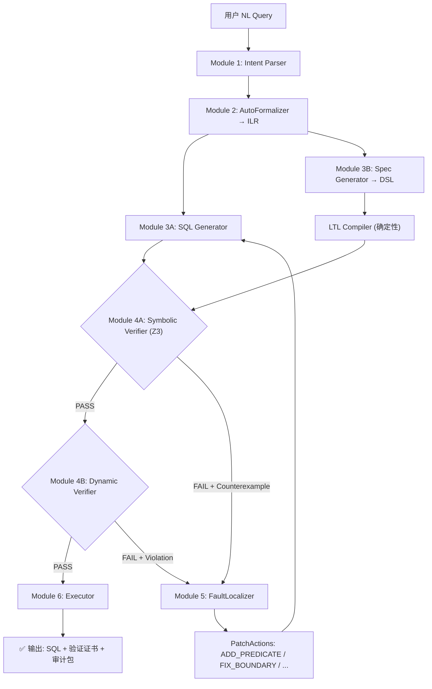

# VeriSQL：Spec-Driven Verification for Text-to-SQL Agents

## 面向 ASE 2026 的完整研究方案（v2.1 — 2026.03.13 更新：冲刺大规模评测与论文）

---

## 摘要

**VeriSQL** 是一个将 Text-to-SQL 从"翻译问题"重新定义为**规范驱动的验证问题**的可验证多智能体架构。其核心思路是：不仅生成 SQL，还同时生成**形式化约束规约（Constraint Spec）**，然后通过混合验证引擎（Static Z3 + Dynamic Sandbox）证明 SQL 满足规约，并在失败时通过**结构化故障定位与 Patch 合成**精确修复。

### 三大核心贡献（ASE 叙事）

| 贡献 | 关键词 | 一句话 |
|------|--------|--------|
| **C1: Spec-first Task Formulation** | 任务重构 | 把 Text-to-SQL 从 NL→SQL 翻译变成 NL→ILR→(SQL ∥ Spec) 的规范满足性问题 |
| **C2: Hybrid Verification Engine** | 混合验证 | SMT 静态证明 + Z3-model-driven 对抗数据合成 + 沙盒动态证伪 |
| **C3: Counterexample-Guided Structured Repair** | 结构化修复 | 反例→故障定位→子句级 PatchAction→确定性修复指令 |

**区别于现有系统**：与 SQLFixAgent、DeepEye-SQL 等依赖执行反馈的"后验"系统不同，VeriSQL 在 SQL **执行前**提供形式化语义保证；与 ToolGate、RvLLM 等通用 LLM 验证框架相比，VeriSQL 针对 SQL/DB 领域深度定制了对抗数据合成与子句级故障定位。

---

## 1. 研究背景与问题定义

### 1.1 现状与痛点

当前 Text-to-SQL 智能体面临**信任危机**：

```
用户问题: "统计Q3的有效订单总额"
                    │
                    ▼
Agent 生成的 SQL:
  SELECT SUM(amount) FROM orders
  WHERE date >= '2024-07-01' AND date <= '2024-09-30'

  ⚠️ 遗漏: status != 'cancelled'
  ⚠️ 后果: 包含了已取消订单，财务数据错误
```

| 痛点 | 描述 | 现有方案的不足 |
|------|------|---------------|
| **逻辑幻觉** | 语法正确但语义错误的 SQL | Self-Reflection 难以检测深层逻辑错误 |
| **隐性错误** | 错误 SQL 因数据分布巧合返回"看似正确"结果 | 执行准确率 (EX) 指标无法发现 |
| **不可审计** | 无法追溯 Agent 推理过程 | LLM 黑盒特性 |
| **业务规则遗漏** | 无法可靠理解隐含业务约束 | Prompt Engineering 效果不稳定 |

### 1.2 研究问题形式化

> **核心问题：** 如何在不牺牲 LLM 语义理解能力的前提下，为生成的 SQL 提供**形式化正确性保证**？

- **输入**：自然语言问题 $Q$，数据库模式 $\mathcal{S}$，业务规则集合 $\mathcal{R}$
- **输出**：SQL 查询 $\sigma$，形式化规约 $\phi$
- **约束**：$\sigma \models \phi$（SQL 蕴含 Spec）

---

## 2. 核心技术架构

### 2.1 系统整体架构



### 2.2 数据流与状态管理

```python
# VeriSQLState (LangGraph TypedDict) 关键字段
query: str                          # 原始 NL 问题
ilr: ILR                            # AutoFormalizer 输出
sql: str                            # SQL Generator 输出
constraint_spec: ConstraintSpec     # Spec Generator 输出
verification_result: VerificationResult  # PASS/FAIL + counterexample
fault_localizations: List[FaultLocalization]  # 故障定位结果
patch_actions: List[PatchAction]    # 结构化修复指令
repair_count: int                   # 修复迭代计数
db_path: str                        # 数据库路径 (用于真实执行)
```

---

## 3. 三大核心贡献详解

### 3.1 C1: Spec-first Task Formulation

**核心洞察**：Text-to-SQL 不应是"翻译问题"，而是"规范满足性问题"。

#### AutoFormalizer 解耦架构

```
NL Query ──→ AutoFormalizer ──→ ILR (中间逻辑表达)
                                     │
                          ┌──────────┴──────────┐
                          ▼                      ▼
                    SQL Generator          Spec Generator
                   (可用不同模型)          (可用不同模型)
```

**ILR (Intent Logic Representation)** 是独立于 SQL 和 LTL 的中间表示，作为"共同参照点"降低双重幻觉风险。

#### DSL 约束类型（5 种）

| 约束类型 | 示例 | Z3 映射 |
|---------|------|---------|
| `FilterDSL` | `status neq cancelled` | `status != "cancelled"` |
| `TemporalConstraint` | `Q3 2024` | `date >= 20240701 ∧ date <= 20240930` |
| `AggregateConstraint` | `MAX(amount)` | 聚合函数存在性检查 |
| `ExistenceConstraint` | `EXISTS(subquery)` | 存在性量词 |
| `UniquenessConstraint` | `DISTINCT(col)` | 唯一性检查 |

#### 已实现组件

| 组件 | 文件 | 状态 |
|------|------|------|
| ILR Schema | `core/ilr.py` | ✅ 完成 |
| DSL 定义 | `core/dsl.py` | ✅ 完成 |
| LTL 编译器 | `core/ltl_compiler.py` | ✅ 确定性编译 |
| Spec 安全解析 | `utils/spec_utils.py` | ✅ 含 sanitize + fallback |
| AutoFormalizer Node | `agents/nodes.py` | ✅ LLM-driven |

---

### 3.2 C2: Hybrid Verification Engine

**核心思路**：静态验证（Proof）+ 动态验证（Falsification）互补。

#### Path A — Static Verifier (Z3 SMT Solver)

```python
# 验证 SQL ⇒ Spec 的逻辑蕴含
solver.add(sql_formula)
solver.add(Not(spec_formula))  # 尝试找反例

if solver.check() == sat:        # 找到反例 → SQL 不满足 Spec
    counterexample = solver.model()
    return FAIL(counterexample)
elif solver.check() == unsat:    # 无反例 → SQL 蕴含 Spec
    return PASS
```

- **能力**：证明所有情况下 SQL 满足 Spec（全称量词）
- **盲区**：数据级边界问题（NULL、字符串截断、除零）

#### Path B — Dynamic Verifier (Sandbox + Z3-Model-Driven Synthesis)

**创新点**：不做随机数据生成，而是**约束驱动的对抗数据合成**。

```python
# 1. "Golden Row"（满足所有约束）
golden = generate_row(mode="satisfy")

# 2. Z3-Model-Driven 反向合成（从 Z3 反例构建真实 DB 行）
if z3_counterexample:
    adversarial = generate_from_z3_model(z3_counterexample)

# 3. 边界对抗行（每个约束生成一个违反值）
for i, constraint in enumerate(spec.constraints):
    boundary = generate_row(mode="violate", target=i)
```

**已实现组件**

| 组件 | 文件 | 特性 |
|------|------|------|
| `SymbolicVerifier` | `utils/z3_utils.py` | Z3 证明/反例 + SchemaValidator |
| `MockDBGenerator` | `modules/dynamic_verifier.py` | 约束驱动 + Z3-model synthesis |
| `SandboxExecutor` | `modules/dynamic_verifier.py` | SQLite in-memory 执行 |
| `DynamicVerifier` | `modules/dynamic_verifier.py` | 编排合成→执行→断言 |

**Operator 覆盖**（_check_filter）：
`eq`, `neq`, `gt`, `lt`, `gte`, `lte`, `in`, `not_in`, `like`, `is_null`, `is_not_null`

---

### 3.3 C3: Counterexample-Guided Structured Repair ⭐

**这是 VeriSQL 最核心的 ASE 创新。**

#### 从文本反馈到结构化 PatchAction

**之前（文本反馈）**：
```
"Missing constraints in SQL: status != cancelled"
→ LLM 可能忽略、误解、或部分修复
```

**现在（结构化 PatchAction）**：
```
=== STRUCTURED REPAIR INSTRUCTIONS ===

[PATCH-1] ADD_PREDICATE in WHERE:
  + Fix to: status != 'cancelled'
  Reason: Counterexample {status: 'cancelled', amount: 150} passes SQL but violates Spec.
  Confidence: 90%

[PATCH-2] FIX_BOUNDARY in WHERE:
  - Current: order_date BETWEEN '2024-07-02' AND '2024-09-30'
  + Fix to: order_date BETWEEN '2024-07-01' AND '2024-09-30'
  Reason: Boundary error, Q3 starts 07-01 not 07-02.
  Confidence: 85%

=== END REPAIR INSTRUCTIONS ===
```

#### FaultLocalizer 算法

```
输入: SQL, ConstraintSpec, VerificationResult (含 counterexample)
输出: List[FaultLocalization] (含 PatchActions)

1. 用 sqlglot 解析 SQL → AST
2. 提取所有 WHERE 子句谓词
3. 对每个 Spec 约束:
   a. 在 AST 中搜索对应谓词
   b. 找不到 → MISSING fault → ADD_PREDICATE
   c. 找到但值不匹配 → BOUNDARY/INCORRECT → FIX_BOUNDARY/FIX_COLUMN
4. 生成结构化 PatchAction，附上反例证据
```

#### PatchAction 类型

| Action Type | 触发场景 | 示例 |
|-------------|---------|------|
| `ADD_PREDICATE` | WHERE 缺少约束 | + `status != 'cancelled'` |
| `FIX_BOUNDARY` | 边界值错误 (> vs >=) | `07-02` → `07-01` |
| `FIX_COLUMN` | 列名引用错误 | `date` → `order_date` |
| `ADD_CAST` | 缺少类型转换 | + `CAST(x AS INTEGER)` |
| `FIX_AGGREGATION` | 聚合逻辑错误 | `LIMIT 1` → `WHERE x = (SELECT MAX(x))` |
| `FIX_JOIN` | JOIN 条件错误 | 修正 ON 条件 |
| `REPLACE_SUBQUERY` | 策略替换 | `ORDER BY LIMIT` → `subquery` |

#### 已实现组件

| 组件 | 文件 | 状态 |
|------|------|------|
| `FaultLocalizer` | `modules/fault_localizer.py` | ✅ ~380 行 |
| `PatchAction` / `PatchActionType` | `agents/state.py` | ✅ 7 种类型 |
| `FaultLocalization` | `agents/state.py` | ✅ Pydantic 模型 |
| `format_patch_actions()` | `modules/fault_localizer.py` | ✅ 格式化输出 |
| `formal_repair_node` | `agents/nodes.py` | ✅ 重写完成 |

---

## 4. 项目状态摘要

本项目的基础设施、验证引擎与结构化修复Agent均已完成**100%代码实现**，系统闭环已经打通，能够在本地单步执行并输出 `PatchAction`。
> **详细的工程代码进度，请参考 [VeriSQL_Progress.md](VeriSQL_Progress.md)。**
> **关于后续大规模实验与论文撰写计划，请参考 [ASE2026_VeriSQL_Task_Plan.md](ASE2026_VeriSQL_Task_Plan.md)。**

---

## 5. 实验设计

### 5.1 数据集

| 数据集 | 规模 | 用途 |
|--------|------|------|
| **BIRD** (主要) | 12,751 问题 + 95 DB | 主实验 + 约束挖掘 |
| Spider 1.0 | 10,181 问题 | 辅助验证 |

### 5.2 评估指标

| 指标 | 定义 | 类型 |
|------|------|------|
| **EX** | 执行结果与 Gold SQL 一致 | 正确性 |
| **SVR** ↓ | 违反业务规则但语法正确的比例 | **安全性 (核心)** |
| **CAA** ↑ | 语义正确 + 业务约束同时满足 | **综合正确性** |
| **RSR** | 获得反馈后一次修复成功 | 修复能力 |
| **BDR** | 故意喂入错误 SQL 的检测率 | Debugging |
| Latency | 额外验证延迟 | 效率 |

### 5.3 对比基线

| Baseline | 特点 | 验证机制 |
|----------|------|---------|
| Arctic-Text2SQL-R1 | BIRD SOTA (81.7% EX) | 无 |
| MTSQL-R1 | 提议→执行→验证→修正 | 执行反馈 |
| MAC-SQL + GPT-4 | 多智能体 | Self-Reflection |
| **VeriSQL (Ours)** | Spec + 混合验证 + 结构化修复 | **SMT + Dynamic** |

### 5.4 消融实验

| 变体 | 去除内容 | 预期 SVR |
|------|---------|---------|
| VeriSQL-NoVerify | 去除所有验证 | ~22% |
| VeriSQL-NoRepair | 验证但不修复 | ~12% |
| VeriSQL-NoDynamic | 只静态 Z3 | ~8% |
| VeriSQL-NoStructuredRepair | 用文本反馈替代 PatchAction | ~7% |
| **VeriSQL-Full** | 完整方案 | **<5%** |

---

## 6. 学术定位与竞品对比

### 6.1 VeriSQL vs 现有方法

| 对比维度 | MTSQL-R1 | Q* + Feedback+ | Post-SQLFix | SQLFixAgent | **VeriSQL** |
|---------|----------|----------------|-------------|-------------|-------------|
| 验证时机 | 执行后 | 执行后 | 修复阶段 | 执行后 | **执行前** |
| 验证方式 | 执行反馈 | 反译对比 | 约束合成 | 工具链检查 | **SMT + Sandbox** |
| 保证类型 | 概率性 | 近似语义 | 局部修复 | 启发式 | **形式化语义** |
| 修复信号 | 模糊文本 | 模糊文本 | 符号修复 | Agent 协作 | **结构化 PatchAction** |
| 反例驱动 | ❌ | ❌ | ❌ | ❌ | ✅ |

### 6.2 论文定位（一句话）

> VeriSQL 把 Text-to-SQL 从"生成问题"转化为**"规范驱动的验证与修复问题"**，通过 SMT 静态证明 + 动态反例微数据库构造 + 结构化故障定位，实现可解释的 PASS/FAIL 与 counterexample-guided structured repair。

### 6.3 Related Work 段落结构

1. **LLM 可信系统的 Contract/Spec + Runtime Verification** — ToolGate, FASTRIC, RvLLM
2. **Autoformalization + Model Checking + Counterexample Repair** — PAT-Agent (ASE 2025)
3. **Verifier-Feedback Guided Generation in SE** — SemGuard (ASE 2025), TerraFormer (ICSE 2026)
4. **Text-to-SQL 修复与系统工程化** — SQLFixAgent, DeepEye-SQL, Reflective Reasoning
5. **安全层/动态交互基准** — SCARE, DySQL-Bench

---

## 7. 风险与应对

### 7.1 双重幻觉 (Correlated Hallucination)

**风险**：同一 LLM 对 SQL 和 Spec 产生一致的误解。
**应对**：(1) 双模型解耦；(2) ILR 中间层强制显式化；(3) 外部知识注入 (Q3=7-9月)。

### 7.2 Spec 准确率 < SQL 准确率

**风险**：Spec 生成错误 → 误报。
**应对**：中间 DSL + 确定性 LTL 编译（DSL 复杂度 << LTL）；消融实验证明 DSL >> 直接 LTL。

### 7.3 约束标注 Ground Truth

**风险**：审稿人质疑"约束也是 LLM 生成的"循环论证。
**应对**：GPT-4 自动标注 500 条 + 人工核验 100 条 + Cohen's Kappa 一致性报告。

---

## 8. 论文结构规划

```
1. Introduction (1.5p)  — 信任危机 + 贡献点总结
2. Problem Definition (1p)  — 形式化定义
3. VeriSQL Architecture (3p)
   3.1 Spec-first Task Formulation (ILR + DSL)
   3.2 Hybrid Verification (Z3 + Dynamic Sandbox)
   3.3 Counterexample-Guided Structured Repair
4. Experiments (2.5p)  — BIRD + baseline + ablation + efficiency
5. Related Work (0.5p)  — 5 个子方向对齐
6. Discussion & Threats to Validity (0.5p)
7. Conclusion (0.5p)

总页数: ~10p (符合 ASE 2026 限制)
```

---

## 9. 技术栈

| 依赖 | 版本 | 用途 |
|------|------|------|
| LangGraph | ≥0.1.0 | Agent 工作流 |
| LangChain | ≥0.2.0 | LLM 集成 |
| z3-solver | ≥4.12.0 | SMT 符号验证 |
| sqlglot | ≥20.0.0 | SQL AST 解析 + 故障定位 |
| Pydantic | ≥2.0.0 | 数据模型校验 |
| pandas/numpy | - | 动态沙盒验证 |
| Gradio | ≥4.0.0 | Demo UI |

---

## 10. 参考文献 (2025-2026)

1. **ToolGate** — Contract-Grounded Verified Tool Execution (arXiv:2601.04688)
2. **FASTRIC** — Prompt Spec Language for Verifiable LLM Interactions (arXiv:2512.18940)
3. **RvLLM** — LLM Runtime Verification with Domain Knowledge (arXiv:2505.18585)
4. **PAT-Agent** — Autoformalization + Model Checking + Counterexample Repair (ASE 2025, arXiv:2509.23675)
5. **SemGuard** — Real-Time Semantic Evaluator for LLM Code (ASE 2025, arXiv:2509.24507)
6. **TerraFormer** — Verifier-Guided IaC Generation (ICSE 2026, arXiv:2601.08734)
7. **SQLFixAgent** — Multi-Agent SQL Repair (arXiv:2406.13408)
8. **DeepEye-SQL** — SDLC-Style Text-to-SQL (arXiv:2510.17586)
9. **SCARE** — Safety Benchmark for Text-to-SQL (arXiv:2511.17559)
10. **DySQL-Bench** — Dynamic Multi-Turn Text-to-SQL (arXiv:2510.26495)
11. **Arctic-Text2SQL-R1** — Open-Source SOTA (Snowflake, Jan 2025)
12. **Xander** — Neuro-Symbolic SQL + Backtracking (AAAI 2025)

---

*文档版本: v2.2 | 更新时间: 2026-03-14 | 面向 ASE 2026 整体研究定调*
